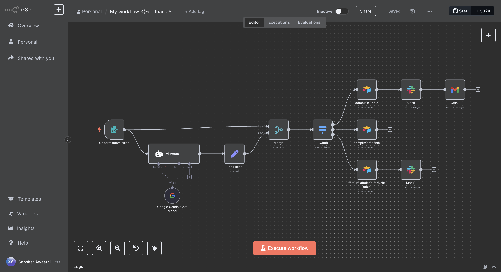

# 🧠 Feedback Segregation System (n8n Workflow)

A complete automation system using **n8n**, **Google Gemini**, **Slack**, **Airtable**, and **Gmail** that routes feedback from users based on whether it is a complaint, compliment, or feature request.

## ⚙️ How it Works

- 🔘 Trigger: Form submission via n8n
- 🧠 Classification: Google Gemini AI classifies the feedback
- 📂 Routing:
  - Airtable (stores based on type)
  - Slack (sends to team)
  - Gmail (auto-respond to complainants)

## 📸 Screenshot

## 📁 Files Included

- `workflow.json` - Exported n8n workflow
- `screenshot.png` - Workflow visual snapshot

## 🧰 Technologies Used

- n8n (self-hosted)
- LangChain + Gemini 1.5 Flash
- Airtable
- Slack
- Gmail

## 🧑‍💻 Author

**Sanskar Awasthi**  
Email: sanskarawasthi94@gmail.com  
GitHub: [sanskar-94](https://github.com/sanskar-94)
